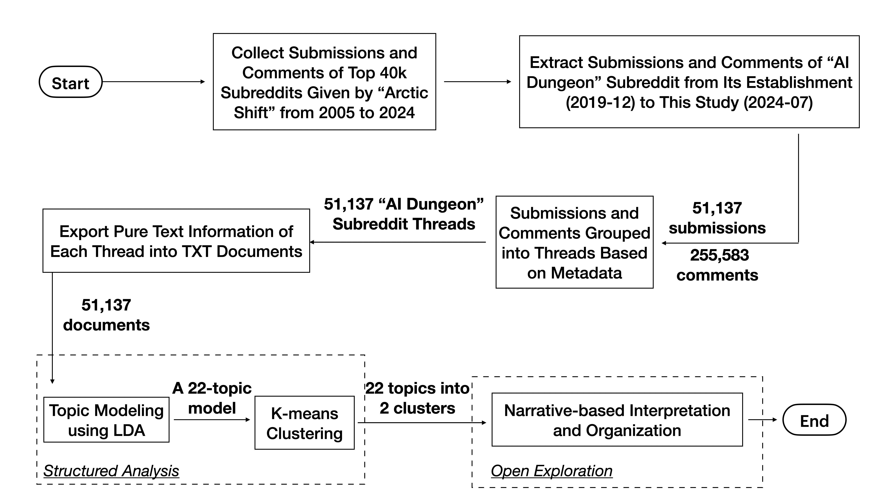
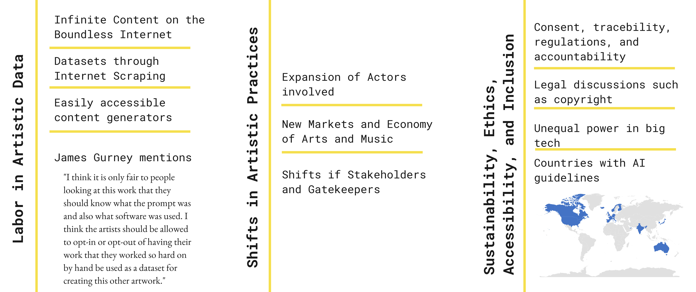
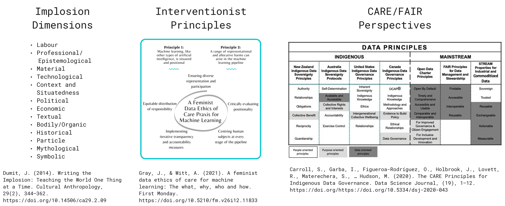
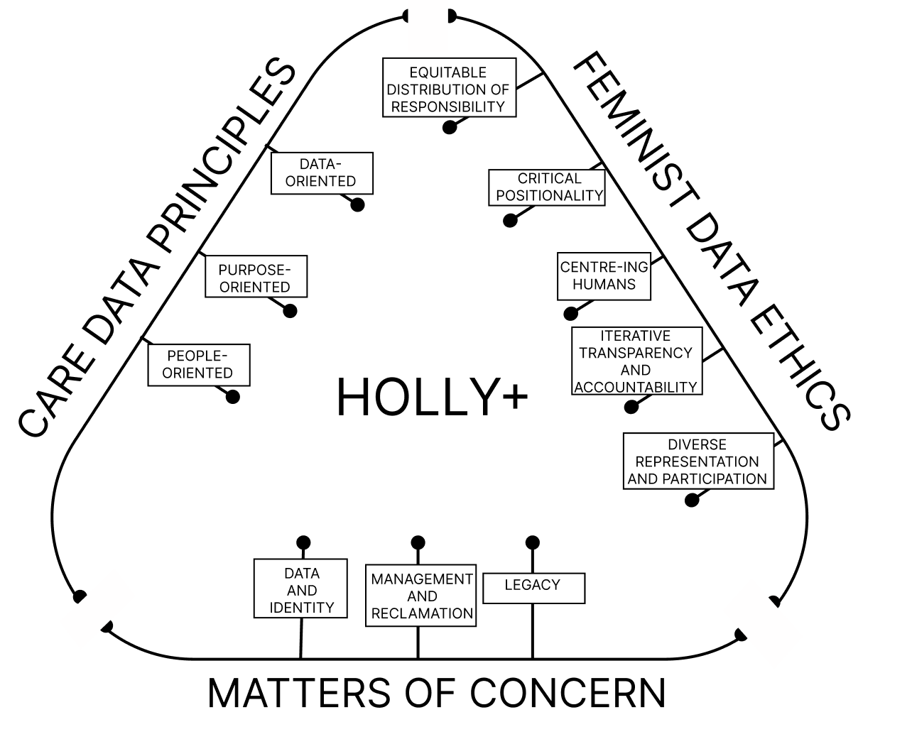
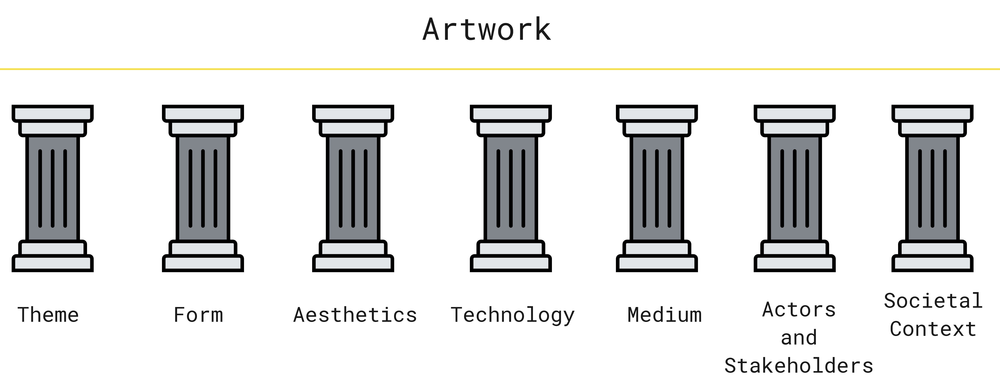

<!-- footer: <small><i>Kıvanç Tatar, Associate Professor</small></i> 
 
 -->

# Machine Learning and Artificial Intelligence Applied to Computational Arts, Music, and Games

<small> These slides are live at: 
https://ktatar.github.io/2026-03-docent-lecture/ </small>

---

## Research Themes

- Deep Learning and Audio Technologies
- AI and in Sound and Music Interactions
- AI in Computational Creativity and Game Design
- Societal Impact of AI in Culture, Arts, and Music

---

### Deep Learning and Audio

Focuses on technical innovations in sound synthesis and modeling using deep learning:

TBD

---

#### Latent Timbre Synthesis

<iframe width="560" height="315" src="https://www.youtube.com/embed/ZJm-N_-ySe0?si=WDxjA7frj4Jj3COq" title="YouTube video player" frameborder="0" allow="accelerometer; autoplay; clipboard-write; encrypted-media; gyroscope; picture-in-picture; web-share" referrerpolicy="strict-origin-when-cross-origin" allowfullscreen></iframe>

<small> K. Tatar, D. Bisig, and P. Pasquier, “Latent Timbre Synthesis,” Neural Computing & Applications, Oct. 2020, doi: 10.1007/s00521-020-05424-2.
</small>

---

#### Latent Timbre Synthesis

---

#### Latent Timbre Synthesis

---

#### Latent Timbre Synthesis

Notes on Reproducibility

---

#### Latent Timbre Synthesis

Notes on Reproducibility

---

#### Latent Timbre Synthesis

Interpolations in the latent space of the VAE

---

#### RawAudio Variational Autoencoder 

in the artwork *Coding the Latent*

<iframe width="560" height="315" src="https://www.youtube.com/embed/rfq82eKE-34?si=1yz17QB_0yfCKHvS&amp;start=2160" title="YouTube video player" frameborder="0" allow="accelerometer; autoplay; clipboard-write; encrypted-media; gyroscope; picture-in-picture; web-share" referrerpolicy="strict-origin-when-cross-origin" allowfullscreen></iframe>

<small> K. Tatar, K. Cotton, and D. Bisig, “Sound Design Strategies for Latent Audio Space Explorations Using Deep Learning Architectures,” presented at the Proceedings of Sound and Music Computing 2023, 2023.</small>

---

#### RawAudio Variational Autoencoder

---

#### RawAudio Variational Autoencoder

---

#### Neuralacoustics

<small>Chen, J., Tatar, K., & Zappi, V.. (2024). A Deep Learning Framework for Musical Acoustics Simulations. In Proceedings of the AI Music Creativity Conference. Oxford, London, September 2024. https://aimc2024.pubpub.org/pub/5cl1cvmy/release/1</small>

---

#### Neuralacoustics

---

#### Neuralacoustics

---

#### Music Notation and Composition with Latent Spaces

**Meta-Benjolin**

 
 
 
 
 
 
 
 

<small>Madaghiele V., Lund L., Holzer D., Kelkar T., Tatar, K., and Holzapfel A. (2026). Expanding the machine: notating generative synthesis with a state-based representation and an interactive timbre space. Organised Sound, Cambridge Press.</small>

---

#### Music Notation and Composition with Latent Spaces

---

#### Music Notation and Composition with Latent Spaces

---

#### Music Notation and Composition with Latent Spaces

<small>Examples of the use of transitions to navigate long distances. D2 used a meander transition in the middle of the piece to connect two sections; within a section, neighbouring states are connected using crossfades. A5 used a crossfade and a meander transition to navigate between two neighbourhoods in the cloud, each corresponding to a section in their piece. (a) Composition by D2 (detail), Sound_example_4.m4a in the sound material. (b) Composition by A5 (detail), Sound_example_5.m4a in the sound material.
</small>

---

#### Music Notation and Composition with Latent Spaces

<small>The space distribution of these two compositions gives information about how the sound evolves in time. While composer D3 created a gradual and constant evolution by navigating the whole point cloud using the meander transition, B3 was interested in exploring local variations and nuances. This difference can be seen by the fact that the viewpoint is zoomed far out in (a), while it is much closer to the cloud in (b).</small>

---

### Multimodal Deep Learning for Movement and Audio

- Raw Music from Free Movements
- Reinforcement Learning for Musical Performances with Moving Machines
- Neural Audio Instruments

---

#### Reinforcement Learning for Musical Performances with Moving Machines

<small>Caravati, Matteo, Tatar, Kıvanç. (2024). Interfacing ErgoJr with Creative Coding Platforms. In Proceedings of the 9th International Conference on Movement and Computing. Utrecht, Netherlands, May 2024. https://dl.acm.org/doi/10.1145/3658852.3659082</small>

---

---

#### Raw Music from Free Movements

---

#### Raw Music from Free Movements

---

#### Raw Music from Free Movements

---

#### Neural Audio Instruments

**0.Stand on the shoulders of giants**

All the core insights from the DMI literature remain relevant 
Challenges like the control bottleneck and the symbolic nature of action-to-sound can become more pronounced under AI-driven conditions 
Established guidance on fostering embodiment in DMIs still applies here as a vital starting point!

---

**1.Search for new modes of interaction.** 
   
The behaviors and “materials” of any instrument strongly condition how musicians interact with it. Neural networks, however, may exhibit properties not easily paralleled in earlier instruments. Hence, novel paradigms, such as directly “traversing” multi-dimensional latent spaces, might offer fresh avenues for mapping movement and cognition to sonic outcomes, potentially unlocking more intuitive or embodied interfaces.

---

**2.Challenge dualities**

A pressing and practical concern for DMIs lies in the traditional control–synthesis divide and the predicate of mapping. We do not suggest abandoning mapping altogether; exploration of how gesture connects to sound is a valuable design tool. However, we advocate a holistic design perspective where sound and gesture are conceived as a unified entity from the outset (Caramiaux et al., 2014), rather than as two separate “containers” later bound by mapping. 

---

**3.Embrace inexplicability (with a grain of salt).**
   
While research on explainable AI is undoubtedly worthwhile, non-explainability can play a significant role in the use and design of neural audio instruments.
Performers and even designers of neural audio systems may choose to focus on musical outcomes rather than dissecting every underlying process. Indeed, not all instrument designs are “predicated on the application of scientific knowledge” (Green, 2011) and a certain measure of “unknowing” can inspire extraordinary results. 

This notion also resonates with broader human-computer interaction discourse on the creative power of ignorance (Grammenos, 2014) (ranging from lack of preconceptions, to true ignorance), where “if you already know where you are going, you are not going someplace new.”

---

**4. Make AI inconspicuous.**

When the AI is not intended to act as a distinct musical agent, making its presence explicit may be unnecessary or even counterproductive. Instead, designers might treat neural audio models as just another invisible part of the instrument's anatomy, like the string of a piano or the integrated circuit of an analog synthesizer. By letting the model manifest itself only through the embodiment of the musician's actions and intentions (the trans-human intentionality), the performer can experience a unified instrument rather than a model endowed with conspicuous (artificial) intelligence. Under the hood, such intelligence may enable feats that would otherwise be impossible, such as large-scale physical modeling (Diaz et al., 2023), multi-stream data handling (Fiebrink and Sonami, 2020), or high-level perceptual organization (Tatar et al., 2020). Yet performers need not be confronted with “AI” per se. By rendering the model seamlessly integral, designers promote an experience of playing an instrument rather than interfacing with an AI model.

---

### AI in Computational Creativity and Game Design

- Towards Computationally Creative Game Design
- Understanding Co-Storytelling with Large Language Models (LLMs)
- AEGIS: Authentic Edge Growth In Sparsity for Link Prediction
- 

---

#### Understanding Co-Storytelling with Large Language Models (LLMs)

<small> AI Dungeon (<`https://play.aidungeon.com/>)  is a text-based adventure game that uses a large language model to generate dynamic and interactive storytelling experiences. Players can input any action or dialogue, and the AI responds with narrative developments, creating a unique story each time. This game exemplifies how LLMs can be used for co-storytelling, allowing players to collaboratively create narratives with the AI in real-time. </small>

  <iframe
    src="https://play.aidungeon.com/"
    title="AI Dungeon"
    style="
      position: absolute;
      inset: 0;
      width: 100%;
      height: 100%;
      border: 0;
    "
    loading="lazy"
    referrerpolicy="no-referrer-when-downgrade"
    allowfullscreen
  ></iframe>

---

#### Understanding Co-Storytelling with Large Language Models (LLMs)

---

#### Understanding Co-Storytelling with Large Language Models (LLMs)

- Users treat LLM co-storytelling as interactive play
- AI imperfections (repetition, incoherence, abrupt shifts, incompleteness) came forward as creative affordances rather than failures.
- Players perceive the AI as a semi-autonomous collaborator in a story that is written together
- User experience revolves around shifting agency between the machine and the player
- Users develop strategies for controlling or guiding the LLM via narrative perspective, prompts, and system features (Story Cards, World Info, Author’s Notes).
- Multimodal storytelling is emerging, with image generation expanding narrative expression.
- Highlights: Wabi-sabi (imperfection appreciation), anthropomorphism/power dynamics, and the game–tool duality of LLM storytelling systems.

---

#### AEGIS: Authentic Edge Growth In Sparsity for Link Prediction

**Game Design Patterns** (Bjork and Holopainen, 2005)

  <iframe
    src="http://virt10.itu.chalmers.se/index.php/Category:Patterns"
    title="AI Dungeon"
    style="
      position: absolute;
      inset: 0;
      width: 100%;
      height: 100%;
      border: 0;
    "
    loading="lazy"
    referrerpolicy="no-referrer-when-downgrade"
    allowfullscreen
  ></iframe>

---

**Classification** -> Embedding -> Generative Game Synthesis

Game Design Patterns (Bjork and Holopainen, 2005) includes 200 patterns.

AEGIS: Authentic Edge Growth In Sparsity for Link Prediction approached the classification problem as a link prediction task.

---

#### Grounding Machine Creativity in Game Design Knowledge Representations
*Empirical Probing of LLM-Based Executable Synthesis of Goal Playable Patterns under Structural Constraints*

We investigated whether large language models can translate structured game‑design knowledge—specifically goal‑pattern  abstractions—into executable Unity game scenes

**Problem framing:** Introduces creative realization as a computational creativity problem—turning design‑pattern abstractions into executable, playable artifacts under real engine constraints.

**Execution‑grounded evaluation pipeline:** Develops a full end‑to‑end workflow (LLM generation → Unity batch compilation → log‑based failure analysis) for assessing executable viability at scale.

**Failure taxonomy:** Identifies and characterizes grounding failures (missing project or engine knowledge) and hygiene failures (syntactic/format issues), showing grounding failures as the primary bottleneck.

**Insights on human–machine knowledge boundaries:** Shows that while IR reduces some failure types, it also increases structural complexity, revealing a tension in how domain knowledge should be injected into generative systems.

---

### Societal Impact of AI in Culture, Arts, and Music

---

#### A Shift in Artistic Practices through Artificial Intelligence 

---

#### Caring Trouble and Musical AI

---

#### Caring Trouble and Musical AI

---

#### Caring Trouble and Musical AI

---

#### Conceptual Pillars of Artistic Creativity

---

#### Expert Procrastinator's Tool: Artificial Intelligence

<iframe width="1920" height="1080" src="https://www.youtube.com/embed/xdf1uKzGYfs?si=2ffM-WlVKZgfJasB" title="YouTube video player" frameborder="0" allow="accelerometer; autoplay; clipboard-write; encrypted-media; gyroscope; picture-in-picture; web-share" referrerpolicy="strict-origin-when-cross-origin" allowfullscreen></iframe>

---

# Thank you! 

Feel free to reach out -> tatar@chalmers.se
