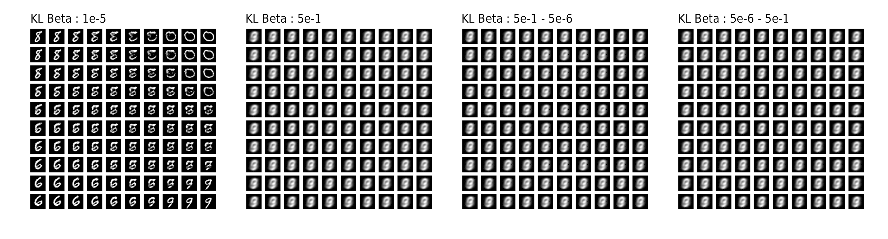
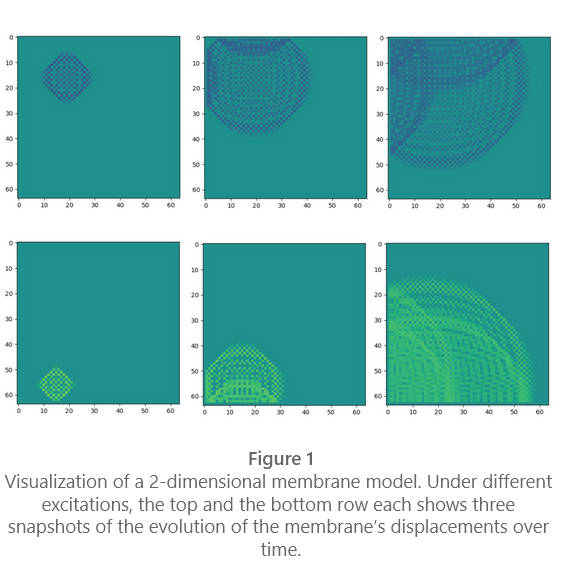
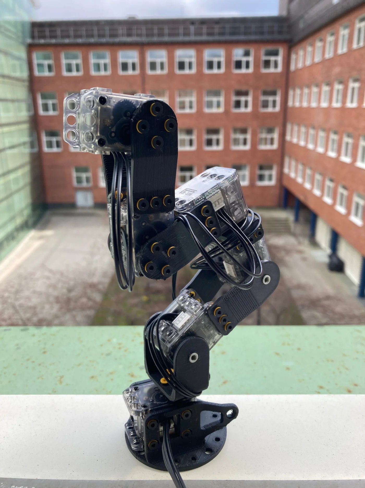
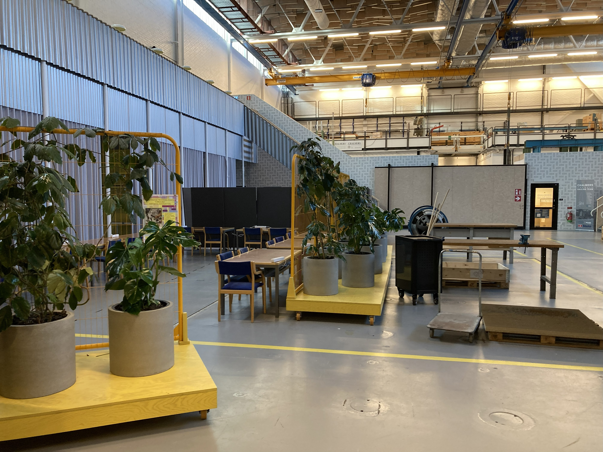

<!-- footer: <small><i>Kıvanç Tatar</small></i> 
 
 -->

# Machine Learning and Artificial Intelligence Applied to Computational Arts, Music, and Games

---

<small> These slides are live at: 
https://ktatar.github.io/2026-03-docent-lecture/ </small>

---

## Research Themes

- Deep Learning and Audio Technologies
- AI and in Sound and Music Interactions
- AI in Computational Creativity and Game Design
- Societal Impact of AI in Culture, Arts, and Music

---

### Deep Learning and Audio

Focuses on technical innovations in sound synthesis and modeling using deep learning:

TBD

---

#### Latent Timbre Synthesis

<iframe width="560" height="315" src="https://www.youtube.com/embed/ZJm-N_-ySe0?si=WDxjA7frj4Jj3COq" title="YouTube video player" frameborder="0" allow="accelerometer; autoplay; clipboard-write; encrypted-media; gyroscope; picture-in-picture; web-share" referrerpolicy="strict-origin-when-cross-origin" allowfullscreen></iframe>

ADD CITATION

---

#### Latent Timbre Synthesis

---

#### Latent Timbre Synthesis

---

#### Latent Timbre Synthesis

Notes on Reproducibility

---

#### Latent Timbre Synthesis

Notes on Reproducibility

---

#### Latent Timbre Synthesis

Interpolations in the latent space of the VAE

---

#### RawAudio Variational Autoencoder 

in the artwork *Coding the Latent*

<iframe width="560" height="315" src="https://www.youtube.com/embed/rfq82eKE-34?si=1yz17QB_0yfCKHvS&amp;start=2160" title="YouTube video player" frameborder="0" allow="accelerometer; autoplay; clipboard-write; encrypted-media; gyroscope; picture-in-picture; web-share" referrerpolicy="strict-origin-when-cross-origin" allowfullscreen></iframe>

---

#### RawAudio Variational Autoencoder

---

#### RawAudio Variational Autoencoder

---

#### Neuralacoustics

---

#### Neuralacoustics

---

#### Neuralacoustics

---

#### Music Notation and Composition with Latent Spaces

---

### Multimodal Deep Learning for Movement and Audio

- Raw Music from Free Movements
- Reinforcement Learning for Musical Performances with Moving Machines
- Neural Audio Instruments

---

#### Reinforcement Learning for Musical Performances with Moving Machines

---

---

#### Raw Music from Free Movements

---

#### Raw Music from Free Movements

---

#### Raw Music from Free Movements

---

#### Neural Audio Instruments

0. Stand on the shoulders of giants
1. 
2. All the core insights from the DMI literature (see Section 2) remain relevant—and perhaps even more critical—when designing neural audio instruments. Challenges like the control bottleneck and the symbolic nature of action-to-sound can become more pronounced under AI-driven conditions, so established guidance on fostering embodiment in DMIs still applies here as a vital starting point!

---

1. Search for new modes of interaction. As (Magnusson 2009) notes, the behaviors and “materials” of any instrument strongly condition how musicians interact with it. Neural networks, however, may exhibit properties not easily paralleled in earlier instruments. Hence, novel paradigms, such as directly “traversing” multi-dimensional latent spaces, might offer fresh avenues for mapping movement and cognition to sonic outcomes, potentially unlocking more intuitive or embodied interfaces than one might initially assume.

2. Challenge dualities. Somaesthetics and phenomenology already question dualities like mind–body and body–environment (Höök et al., 2021) and future work on neural audio may similarly challenge a strict training–inference split (Section 5.4). Moreover, a pressing and practical concern for DMIs lies in the traditional control–synthesis divide and the predicate of mapping. We do not suggest abandoning mapping altogether; exploration of how gesture connects to sound is a valuable design tool. However, we advocate a holistic design perspective where sound and gesture are conceived as a unified entity from the outset (Caramiaux et al., 2014), rather than as two separate “containers” later bound by mapping. Once this integrated foundation has been laid, the technological challenges of AI, neural networks, data and training can be addressed without losing an inherently embodied connection between motion and sonic outcome. This approach paves the way for more inventive metaphors and interaction techniques that surpass mere iterative adjustments to input and output streams.

3. Embrace inexplicability (with a grain of salt). While research on explainable AI is undoubtedly worthwhile, non-explainability can play a significant role in the use and design of neural audio instruments. A flute player, for instance, need not fully grasp the acoustic physics behind overtone production to exploit them masterfully. Likewise, performers and even designers of neural audio systems may choose to focus on musical outcomes rather than dissecting every underlying process. Indeed, not all instrument designs are “predicated on the application of scientific knowledge” (Green, 2011) and a certain measure of “unknowing” can inspire extraordinary results. By positioning neural audio synthesis at the intersection of scientific modeling and pure intuition, designers can open pathways to creative strategies unattainable through rational design alone. This notion also resonates with broader human-computer interaction discourse on the creative power of ignorance (Grammenos, 2014) (ranging from lack of preconceptions, to true ignorance), where “if you already know where you are going, you are not going someplace new.”

4. Make AI inconspicuous. When the AI is not intended to act as a distinct musical agent, making its presence explicit may be unnecessary or even counterproductive. Instead, designers might treat neural audio models as just another invisible part of the instrument's anatomy, like the string of a piano or the integrated circuit of an analog synthesizer. By letting the model manifest itself only through the embodiment of the musician's actions and intentions (the trans-human intentionality), the performer can experience a unified instrument rather than a model endowed with conspicuous (artificial) intelligence. Under the hood, such intelligence may enable feats that would otherwise be impossible, such as large-scale physical modeling (Diaz et al., 2023), multi-stream data handling (Fiebrink and Sonami, 2020), or high-level perceptual organization (Tatar et al., 2020). Yet performers need not be confronted with “AI” per se. By rendering the model seamlessly integral, designers promote an experience of playing an instrument rather than interfacing with an AI model.

---

| Activities  |  |  | | |
|:---|---|---|---|---|
| **Lectures** | Introduction to Art and Technology | Introduction to AI and ML | Creativity, Group work, and Tools for Innovation |
| **Tutorials** | Creative Coding with Sound (PureData) | Multimedia Design with TouchDesigner | Deep Learning for Multimedia | Interactive ML with Physical Computing |
| **Project** |Project Proposal| Design Iterations | Final Prototype | Reflections |

Text border size is set in section class *padding: 5%* in my_theme.css

---
<!-- _class: no_border -->

## This is the same table without borders

| Activities  |  |  | | |
|:---|---|---|---|---|
| **Lectures** | Introduction to Art and Technology | Introduction to AI and ML | Creativity, Group work, and Tools for Innovation |
| **Tutorials** | Creative Coding with Sound (PureData) | Multimedia Design with TouchDesigner | Deep Learning for Multimedia | Interactive ML with Physical Computing |
| **Project** |Project Proposal| Design Iterations | Final Prototype | Reflections |

See how *Activities* are not bold now. That is because th class is updated in section.no_border class in my_theme.css  

---
<!-- _class: columns -->

## Two column slide

Originally solution from <https://github.com/orgs/marp-team/discussions/192#discussioncomment-1516155>

## Can't believe this works. YOLO

If you are brave for more sections, here is an online tool for css grids: https://grid.layoutit.com/

---

## Image on the left

---

## AND Image on the right

---

## Image aligned on the left

---

# Image aligned on the right

---

# Image aligned at the center

---

# Local videos are possible 

<video controls src="pb-ars.mp4" width="800"></video>

---

# Online videos as well 

<iframe width="560" height="315" src="https://www.youtube.com/embed/nx2Nj3I7NyU?si=5D-PemuLUUt3qepd&amp;controls=0" title="YouTube video player" frameborder="0" allow="accelerometer; autoplay; clipboard-write; encrypted-media; gyroscope; picture-in-picture; web-share" referrerpolicy="strict-origin-when-cross-origin" allowfullscreen></iframe>

This should work only when the presentation is hosted online. Youtube does not allow local hosts apparently.

---

# Fancy image options

` ` command works for creating empty spaces [2].

 

<small>[1] this is a smaller text. Great for citations. 

[2] https://marpit.marp.app/image-syntax
</small>

---

# Inline HTML commands works 

 Text can be changed for example 

---

# <!--fit-->BIG TEXT

---

# How to export to github pages? 

- Copy this template
- Setup github pages to deploy from a branch. Choose main branch. 
  - There is no workflow, so that what you see local is what you get online as a static html. 
- Once you are done with your presentation, render it to html locally.
  - On VS Code, you can just use the marp icon on the top right. 
  - Make sure the file saved is index.html.  
- Commit changes to the remote repo.
- Done! Page should be online at [user-name].github.io/[repo-name] after a few minutes.

---

# Latex Math friendly

## Inline math

Render inline math such as $ax^2+bc+c$ [1].

## Math block

$$ I_{xx}=\int\int_Ry^2f(x,y)\cdot{}dydx $$

$$
f(x) =
  \int_{-\infty}^\infty
  \hat f(\xi)\,e^{2 \pi i \xi x}
  \,d\xi
$$

 

<small>[1] More details: https://github.com/marp-team/marp/blob/main/website/docs/guide/math-typesetting.md </small>

---

# Videos need to be formatted for web

You can use ffmpeg locally for this.

`ffmpeg -i input.mp4 -c:v libvpx-vp9 -crf 30 -b:v 0 output.webm` 

note: tested and works

<small>[1] Source: https://jshakespeare.com/encoding-browser-friendly-video-files-with-ffmpeg/ </small>

---

# FFMPEG continued: another solution

fast and efficient h264 for the web :

`ffmpeg -i in.mp4 -c:v libx264 -profile:v high -preset slow -crf 24 -c:a aac -b:a 96k -movflags +faststart out.mp4`

More efficient but slower with VP9/webm

`ffmpeg -i in.mp4 -c:v libvpx-vp9 -crf 33 -b:v 0 -c:a libopus -vbr on -b:a 64k out.webm`

<small>[1] https://www.reddit.com/r/ffmpeg/comments/8kxjhz/encoding_video_for_my_website/ </small>

---

# FFMPEG continued

I haven't tried this solution yet.

WebM:

`ffmpeg -i my-original-video.wmv -f webm -vcodec libvpx-vp9 -vb 1024k my-new-video.webm`

MP4: 

`ffmpeg -i my-original-video.wmv -vcodec libx264 -f mp4 -vb 1024k -preset slow my-new-video.mp4`

<small>[1] Source: https://jshakespeare.com/encoding-browser-friendly-video-files-with-ffmpeg/ </small>